# Echo-AI Architecture Documentation

## Overview

Echo-AI is a voice-powered AI coaching application that helps users set and achieve goals through natural conversation. The system uses voice AI (Vapi) for interaction and WhatsApp for summaries and reminders.

**Architecture Style**: Three-tier architecture with microservices integration
**Development Approach**: Adaptive hybrid AI agent methodology optimized for hackathon velocity
**Target Platforms**: iOS, Android, Web (via React Native/Expo)

---

## System Architecture

### High-Level Architecture Diagram


### Architecture Layers

#### 1. **Client Layer (Frontend)**
- **Technology**: React Native with Expo managed workflow
- **Platforms**: iOS, Android, Web
- **Purpose**: User interface and voice interaction orchestration
- **Key Features**:
  - JWT-based authentication
  - Voice call management via Vapi SDK
  - Real-time emotion detection from transcripts
  - Goal visualization and management
  - Cross-platform compatibility

#### 2. **API Gateway (Backend)**
- **Technology**: Node.js + Express.js + TypeScript
- **Purpose**: Business logic, authentication, and data orchestration
- **Key Features**:
  - RESTful API endpoints
  - JWT token validation
  - Webhook receivers for Vapi events
  - WhatsApp integration via Pipedream
  - CORS configuration for cross-origin requests

#### 3. **External Services**
- **Vapi Voice AI**: Real-time voice conversation processing
- **WhatsApp (via Pipedream)**: Asynchronous notifications and summaries

#### 4. **Data Layer**
- **Technology**: PostgreSQL relational database
- **Purpose**: Persistent storage for users, goals, and metadata

---

## Component Architecture

### Backend Components


**Backend Component Descriptions**:

| Component | File | Responsibility |
|-----------|------|----------------|
| **Server** | `server.ts` | Application bootstrap, middleware setup, route registration |
| **Auth Routes** | `routes/auth.routes.ts` | `/register`, `/login` endpoint definitions |
| **Goal Routes** | `routes/goal.routes.ts` | CRUD endpoints for goals (protected by JWT) |
| **Webhook Routes** | `routes/webhook.routes.ts` | Vapi event receivers (`/conversation-end`, `/message`) |
| **Auth Middleware** | `middleware/auth.middleware.ts` | JWT token validation and user context injection |
| **Auth Controller** | `controllers/auth.controller.ts` | User registration/login business logic |
| **Goal Controller** | `controllers/goal.controller.ts` | Goal CRUD operations |
| **Webhook Controller** | `controllers/webhook.controller.ts` | Vapi event processing and WhatsApp triggering |
| **User Model** | `models/user.model.ts` | User CRUD, password hashing (bcrypt) |
| **Goal Model** | `models/goal.model.ts` | Goal CRUD with filtering and pagination |
| **Pipedream Service** | `services/pipedream.service.ts` | WhatsApp notification via webhook |
| **JWT Utility** | `utils/jwt.ts` | Token generation and verification |
| **Database Config** | `config/database.ts` | PostgreSQL connection pool |

### Frontend Components


**Frontend Component Descriptions**:

| Component | File | Responsibility |
|-----------|------|----------------|
| **App** | `App.tsx` | Root component, context providers, navigation wrapper |
| **RootNavigator** | `navigation/index.tsx` | Conditional rendering (AuthNav vs MainNav) |
| **AuthNavigator** | `navigation/index.tsx` | Stack navigator for Login/Register |
| **MainNavigator** | `navigation/index.tsx` | Bottom tab navigator (Voice, History, Profile) |
| **AuthContext** | `contexts/AuthContext.tsx` | Global auth state (user, token, login/logout) |
| **GoalContext** | `contexts/GoalContext.tsx` | Global goals state and CRUD operations |
| **VoiceScreen** | `screens/voice/VoiceScreen.tsx` | Main voice interaction UI with emotion detection |
| **LoginScreen** | `screens/auth/LoginScreen.tsx` | User login form |
| **RegisterScreen** | `screens/auth/RegisterScreen.tsx` | User registration form |
| **HistoryScreen** | `screens/history/HistoryScreen.tsx` | Conversation history (placeholder) |
| **ProfileScreen** | `screens/profile/ProfileScreen.tsx` | User profile and settings |
| **useVapi** | `hooks/useVapi.ts` | Vapi call lifecycle, emotion detection, transcripts |
| **useAuth** | Custom hook (from AuthContext) | Auth operations wrapper |
| **vapiService** | `services/vapiService.ts` | Vapi SDK initialization and event handling |
| **authService** | `services/authService.ts` | Login/register API calls |
| **goalService** | `services/goalService.ts` | Goal CRUD API calls |
| **api.ts** | `services/api.ts` | Axios instance with JWT interceptor |
| **BeatingHeart** | `components/BeatingHeart.tsx` | Animated heart visualization |

---

## Data Flow Diagrams

### 1. User Registration Flow


### 2. Voice Conversation Flow


### 3. Goal Management Flow


### 4. Emotion Detection Flow

```mermaid
flowchart TD
    A[Vapi sends transcript event] --> B{Is role 'user'?}
    B -->|No| Z[Ignore]
    B -->|Yes| C[Extract transcript text]

    C --> D[Convert to lowercase]
    D --> E[Check emotion patterns]

    E --> F{Contains 'stressed'<br/>keywords?}
    F -->|Yes| G[Emotion: Stressed 😰<br/>Coaching: CALM]

    F -->|No| H{Contains 'anxious'<br/>keywords?}
    H -->|Yes| I[Emotion: Anxious 😟<br/>Coaching: CALM]

    H -->|No| J{Contains 'defeated'<br/>keywords?}
    J -->|Yes| K[Emotion: Defeated 😔<br/>Coaching: PUSH]

    J -->|No| L{Contains 'motivated'<br/>keywords?}
    L -->|Yes| M[Emotion: Motivated 💪<br/>Coaching: REINFORCE]

    L -->|No| N{Contains 'calm'<br/>keywords?}
    N -->|Yes| O[Emotion: Calm 😌<br/>Coaching: REINFORCE]

    N -->|No| P[No emotion detected]

    G --> Q[Update detectedEmotion state]
    I --> Q
    K --> Q
    M --> Q
    O --> Q

    Q --> R[Display emotion badge in UI]
    R --> S[Pass to Vapi for context-aware coaching]
```



---

## Database Schema

### Entity-Relationship Diagram


### Table Definitions

**users**
```sql
CREATE TABLE users (
    id SERIAL PRIMARY KEY,
    email VARCHAR(255) UNIQUE NOT NULL,
    password_hash VARCHAR(255) NOT NULL,
    full_name VARCHAR(255) NOT NULL,
    phone_number VARCHAR(20),
    created_at TIMESTAMP DEFAULT CURRENT_TIMESTAMP,
    updated_at TIMESTAMP DEFAULT CURRENT_TIMESTAMP
);

CREATE INDEX idx_users_email ON users(email);
```

**goals**
```sql
CREATE TABLE goals (
    id SERIAL PRIMARY KEY,
    user_id INTEGER NOT NULL REFERENCES users(id) ON DELETE CASCADE,
    title VARCHAR(255) NOT NULL,
    description TEXT,
    category VARCHAR(50) NOT NULL CHECK (category IN ('career', 'health', 'financial', 'education', 'relationships', 'personal', 'creative')),
    status VARCHAR(20) DEFAULT 'active' CHECK (status IN ('active', 'completed', 'abandoned', 'on_hold')),
    created_from_voice BOOLEAN DEFAULT false,
    vapi_conversation_id VARCHAR(255),
    target_date DATE,
    created_at TIMESTAMP DEFAULT CURRENT_TIMESTAMP,
    updated_at TIMESTAMP DEFAULT CURRENT_TIMESTAMP
);

CREATE INDEX idx_goals_user_id ON goals(user_id);
CREATE INDEX idx_goals_status ON goals(status);
CREATE INDEX idx_goals_category ON goals(category);
CREATE INDEX idx_goals_vapi_conversation_id ON goals(vapi_conversation_id);
```

---

## Technology Stack

### Backend Stack

| Technology | Version | Purpose |
|------------|---------|---------|
| **Node.js** | 18.0.0+ | JavaScript runtime |
| **Express.js** | 4.18.2 | Web framework |
| **TypeScript** | 5.3.2 | Type safety and developer experience |
| **PostgreSQL** | 8.11.3 (pg driver) | Relational database |
| **bcryptjs** | 3.0.3 | Password hashing |
| **jsonwebtoken** | 9.0.2 | JWT authentication |
| **express-validator** | 7.0.1 | Request validation |
| **axios** | 1.6.2 | HTTP client for Pipedream |
| **cors** | 2.8.5 | Cross-origin resource sharing |
| **morgan** | 1.10.0 | HTTP request logger |
| **dotenv** | 16.3.1 | Environment variable management |
| **nodemon** | 3.0.2 | Development auto-reload |
| **jest** | 29.7.0 | Testing framework |

### Frontend Stack

| Technology | Version | Purpose |
|------------|---------|---------|
| **React** | 19.1.0 | UI framework |
| **React Native** | 0.81.5 | Mobile framework |
| **Expo** | 54.0.0 | Development platform |
| **TypeScript** | 5.9.2 | Type safety |
| **React Navigation** | 6.x | Navigation (Stack + Bottom Tabs) |
| **@vapi-ai/web** | 2.5.1 | Vapi SDK for voice AI |
| **axios** | 1.6.2 | HTTP client |
| **@react-native-async-storage** | 2.2.0 | Token storage |
| **react-hook-form** | 7.49.0 | Form validation |

### External Services

| Service | Purpose | Integration Method |
|---------|---------|-------------------|
| **Vapi** | Voice AI conversation processing | SDK (frontend) + Webhooks (backend) |
| **WhatsApp** | Conversation summaries and notifications | Pipedream webhook |
| **Pipedream** | Serverless workflow orchestration | REST API webhook trigger |

---

## API Endpoints

### Authentication Endpoints

| Method | Endpoint | Auth Required | Description |
|--------|----------|---------------|-------------|
| POST | `/api/v1/auth/register` | No | Create new user account |
| POST | `/api/v1/auth/login` | No | User login, returns JWT token |

**Example Request: Register**
```json
POST /api/v1/auth/register
{
  "email": "user@example.com",
  "password": "securePassword123",
  "fullName": "John Doe",
  "phoneNumber": "+1234567890"
}
```

**Example Response: Register**
```json
{
  "success": true,
  "data": {
    "user": {
      "id": 1,
      "email": "user@example.com",
      "fullName": "John Doe",
      "phoneNumber": "+1234567890",
      "createdAt": "2025-11-19T10:00:00.000Z"
    },
    "token": "eyJhbGciOiJIUzI1NiIsInR5cCI6IkpXVCJ9..."
  }
}
```

### Goal Endpoints

| Method | Endpoint | Auth Required | Description |
|--------|----------|---------------|-------------|
| POST | `/api/v1/goals` | Yes | Create a new goal |
| GET | `/api/v1/goals` | Yes | List user's goals (with filters) |
| GET | `/api/v1/goals/:id` | Yes | Get goal details |
| PUT | `/api/v1/goals/:id` | Yes | Update goal |
| DELETE | `/api/v1/goals/:id` | Yes | Delete goal |

**Example Request: Create Goal**
```json
POST /api/v1/goals
Authorization: Bearer <token>
{
  "title": "Exercise 3 times a week",
  "description": "Focus on cardio and strength training",
  "category": "health",
  "targetDate": "2025-12-31",
  "createdFromVoice": true,
  "vapiConversationId": "conv_abc123"
}
```

**Example Response: List Goals**
```json
{
  "success": true,
  "data": {
    "goals": [
      {
        "id": 1,
        "userId": 1,
        "title": "Exercise 3 times a week",
        "description": "Focus on cardio and strength training",
        "category": "health",
        "status": "active",
        "createdFromVoice": true,
        "vapiConversationId": "conv_abc123",
        "targetDate": "2025-12-31",
        "createdAt": "2025-11-19T10:00:00.000Z",
        "updatedAt": "2025-11-19T10:00:00.000Z"
      }
    ],
    "total": 1
  }
}
```

### Webhook Endpoints

| Method | Endpoint | Auth Required | Description |
|--------|----------|---------------|-------------|
| POST | `/api/v1/webhooks/vapi/conversation-end` | No* | Receive Vapi conversation end events |
| POST | `/api/v1/webhooks/vapi/message` | No* | Receive Vapi message events |

*Webhooks are authenticated via Vapi signature validation (if configured)

**Example Webhook Payload: Conversation End**
```json
POST /api/v1/webhooks/vapi/conversation-end
{
  "conversationId": "conv_abc123",
  "userId": 1,
  "transcript": "I want to exercise more and eat healthier...",
  "duration": 120,
  "timestamp": "2025-11-19T10:00:00.000Z"
}
```

---

## Integration Architecture

### Vapi Voice AI Integration

**Integration Type**: Dual (SDK + Webhooks)

**Frontend Integration (SDK)**:
```typescript
// Mobile app uses Vapi Web SDK
import Vapi from '@vapi-ai/web';

const vapi = new Vapi('<PUBLIC_KEY>');

// Start call with assistant
await vapi.start({
  assistantId: '<ASSISTANT_ID>',
  metadata: {
    userId: user.id,
    timestamp: new Date().toISOString()
  }
});

// Listen to events
vapi.on('message', (message) => {
  if (message.type === 'transcript') {
    // Process transcripts for emotion detection
  }
});
```

**Backend Integration (Webhooks)**:
```typescript
// Express endpoint receives Vapi events
app.post('/api/v1/webhooks/vapi/conversation-end', async (req, res) => {
  const { conversationId, transcript, userId } = req.body;

  // Extract goals from conversation using NLP/AI
  const goals = extractGoalsFromTranscript(transcript);

  // Save goals to database
  for (const goal of goals) {
    await createGoal({
      userId,
      ...goal,
      createdFromVoice: true,
      vapiConversationId: conversationId
    });
  }

  // Trigger WhatsApp summary
  await triggerWhatsAppSummary({
    userId,
    conversationSummary: transcript,
    goalsCreated: goals
  });

  res.status(200).json({ success: true });
});
```

### WhatsApp Integration (via Pipedream)

**Integration Type**: Webhook Trigger

**Flow**:
1. Backend triggers Pipedream webhook after conversation ends
2. Pipedream workflow receives payload with conversation summary
3. Pipedream formats message and sends via WhatsApp API
4. User receives WhatsApp notification

**Backend Trigger**:
```typescript
// services/pipedream.service.ts
export const triggerWhatsAppSummary = async (data: WhatsAppSummaryData) => {
  await axios.post(PIPEDREAM_WEBHOOK_URL, {
    userId: data.userId,
    userName: data.userName,
    phoneNumber: data.phoneNumber,
    conversationSummary: data.conversationSummary,
    goalsCreated: data.goalsCreated,
    timestamp: data.timestamp
  });
};
```

**Pipedream Workflow Structure**:
```yaml
steps:
  - name: receive_webhook
    type: webhook

  - name: format_message
    code: |
      const { userName, conversationSummary, goalsCreated } = steps.receive_webhook.event.body;

      let message = `Hi ${userName}! 🎯\n\n`;
      message += `Here's your coaching session summary:\n\n`;
      message += `${conversationSummary}\n\n`;

      if (goalsCreated.length > 0) {
        message += `Goals created:\n`;
        goalsCreated.forEach(goal => {
          message += `• ${goal.title} (${goal.category})\n`;
        });
      }

      return message;

  - name: send_whatsapp
    action: whatsapp.send_message
    params:
      to: ${{ steps.receive_webhook.event.body.phoneNumber }}
      message: ${{ steps.format_message.return_value }}
```

---

## Security Architecture

### Authentication & Authorization

**JWT Token Flow**:


**Security Measures**:

| Layer | Security Feature | Implementation |
|-------|------------------|----------------|
| **Authentication** | JWT tokens | jsonwebtoken library with HS256 |
| **Password Storage** | Bcrypt hashing | bcryptjs with 10 salt rounds |
| **CORS** | Cross-origin control | cors middleware (allow all for hackathon) |
| **HTTPS** | Transport encryption | Required in production deployment |
| **SQL Injection** | Parameterized queries | PostgreSQL prepared statements |
| **Token Expiry** | Session timeout | JWT exp claim (configurable) |
| **Authorization** | User-scoped queries | WHERE user_id = $userId in all goal queries |

### Data Privacy

**Sensitive Data Handling**:
- Passwords: Never stored in plaintext, bcrypt hashed
- Transcripts: Stored temporarily for goal extraction (can be configured to delete)
- Phone numbers: Optional field, required only for WhatsApp integration
- User data: Scoped by user_id, no cross-user data leakage

---

## Deployment Architecture

### Development Environment

```
┌─────────────────────────────────────────────────────────────┐
│ Developer Machine                                           │
│                                                             │
│  ┌──────────────────┐         ┌───────────────────────┐   │
│  │  Mobile App      │         │  Backend API          │   │
│  │  (Expo Dev)      │◄───────►│  (nodemon)            │   │
│  │  localhost:8081  │         │  localhost:3000       │   │
│  └──────────────────┘         └───────────────────────┘   │
│           │                              │                 │
│           │                              │                 │
│           ▼                              ▼                 │
│  ┌──────────────────┐         ┌───────────────────────┐   │
│  │  Vapi Cloud      │         │  PostgreSQL           │   │
│  │  (External)      │         │  localhost:5432       │   │
│  └──────────────────┘         └───────────────────────┘   │
└─────────────────────────────────────────────────────────────┘
```

**Local Development Setup**:
1. PostgreSQL running on localhost:5432
2. Backend running on localhost:3000 (or 0.0.0.0 for network access)
3. Mobile app connects to backend via network IP
4. Vapi integration uses public Vapi cloud

### Production Architecture (Recommended)

```mermaid
graph TB
    subgraph "CDN"
        CDN[CloudFront/CDN<br/>Static Assets]
    end

    subgraph "Client Devices"
        iOS[iOS App]
        Android[Android App]
        WebApp[Web App]
    end

    subgraph "AWS / Cloud Platform"
        ALB[Application Load Balancer]

        subgraph "Compute"
            API1[API Server 1<br/>ECS/Fargate]
            API2[API Server 2<br/>ECS/Fargate]
        end

        subgraph "Database"
            RDS[(RDS PostgreSQL<br/>Multi-AZ)]
        end

        subgraph "Cache"
            Redis[(ElastiCache Redis)]
        end
    end

    subgraph "External Services"
        VapiProd[Vapi Production]
        PipedreamProd[Pipedream]
        WhatsAppProd[WhatsApp Business API]
    end

    iOS --> ALB
    Android --> ALB
    WebApp --> CDN
    CDN --> ALB

    iOS <--> VapiProd
    Android <--> VapiProd
    WebApp <--> VapiProd

    ALB --> API1
    ALB --> API2

    API1 --> RDS
    API2 --> RDS

    API1 --> Redis
    API2 --> Redis

    API1 --> PipedreamProd
    API2 --> PipedreamProd

    VapiProd -.Webhooks.-> ALB
    PipedreamProd --> WhatsAppProd
```

**Production Deployment Checklist**:
- [ ] Environment variables configured (JWT_SECRET, database credentials)
- [ ] HTTPS/TLS enabled on load balancer
- [ ] Database backups enabled (automated snapshots)
- [ ] CORS restricted to production domains
- [ ] Rate limiting enabled on API endpoints
- [ ] Monitoring and logging (CloudWatch, DataDog, etc.)
- [ ] Auto-scaling configured for API servers
- [ ] CDN configured for static assets
- [ ] Database connection pooling optimized
- [ ] Vapi production assistant configured with proper prompts

---

## Performance Considerations

### Scalability Targets

| Metric | Target | Strategy |
|--------|--------|----------|
| **Concurrent Users** | 10,000+ | Horizontal scaling of API servers |
| **API Response Time** | < 100ms (p95) | Database indexing, connection pooling |
| **Voice Call Latency** | < 200ms | Vapi cloud infrastructure |
| **Database Queries** | < 50ms | Indexed queries, query optimization |
| **Frontend Load Time** | < 2s | Code splitting, lazy loading |

### Optimization Strategies

**Backend**:
- Database connection pooling (pg pool)
- Indexed queries on user_id, status, category
- Pagination for goal lists (default limit: 10)
- Async/await for non-blocking I/O
- Graceful error handling (non-critical features don't block)

**Frontend**:
- React Navigation lazy loading
- AsyncStorage for token persistence
- Axios request/response interceptors for token refresh
- Debounced search inputs
- Optimistic UI updates for goal actions

**Database**:
- Indexes on foreign keys and frequently queried columns
- TIMESTAMP fields for created_at/updated_at
- Cascade deletes for user → goals relationship

---

## Development Workflow

### Phase 1: Foundation (Hour 1)
- ✅ Project scaffolding (Expo + Node.js)
- ✅ PostgreSQL database setup
- ✅ User model and JWT authentication
- ✅ Basic login/register screens

### Phase 2: Parallel Features (Hours 2-4)
- ✅ **Backend Stream**: Goal CRUD APIs, Vapi webhooks
- ✅ **Frontend Stream**: Goal screens, navigation, voice UI
- ✅ **Vapi Stream**: Voice call integration, emotion detection
- ⏳ **WhatsApp Stream**: Pipedream workflow, message templates

### Phase 3: Integration & Demo (Hours 5-6)
- ⏳ End-to-end testing
- ⏳ Demo script preparation
- ⏳ UI polish

---

## Future Architecture Enhancements

### Phase 2 Features
- **Goal Progress Tracking**: Milestones, sub-goals, progress percentages
- **Notifications**: Push notifications for reminders
- **Analytics**: User engagement metrics, goal completion rates
- **Caching Layer**: Redis for frequently accessed data

### Phase 3 Features
- **Real-time Sync**: WebSocket for live goal updates
- **Offline Mode**: Local storage with sync when online
- **Team Goals**: Shared goals with collaboration features
- **Calendar Integration**: Google Calendar, Apple Calendar sync

### Phase 4 Features
- **Premium Tier**: Advanced coaching, priority support
- **AI Insights**: Predictive analytics, personalized recommendations
- **Integration Ecosystem**: Notion, Todoist, Trello, health apps
- **Admin Dashboard**: User management, analytics, content moderation

---

## Troubleshooting & Common Issues

### Backend Issues

**Issue**: Database connection fails
**Solution**: Check PostgreSQL is running, verify DATABASE_URL in .env

**Issue**: JWT token expired
**Solution**: Implement token refresh mechanism or extend expiry time

**Issue**: CORS errors from mobile app
**Solution**: Verify backend CORS allows mobile app origin

### Frontend Issues

**Issue**: Cannot connect to backend from mobile device
**Solution**: Use network IP instead of localhost, run `npm run network-ip`

**Issue**: Vapi call fails to start
**Solution**: Verify EXPO_PUBLIC_VAPI_ASSISTANT_ID and public key are set

**Issue**: Token not persisting
**Solution**: Check AsyncStorage permissions and await storage operations

### Integration Issues

**Issue**: WhatsApp not receiving messages
**Solution**: Verify Pipedream webhook URL, check phone number format

**Issue**: Vapi webhooks not received
**Solution**: Verify webhook URL is publicly accessible (use ngrok for local dev)

---

## References

- [Express.js Documentation](https://expressjs.com/)
- [React Native Documentation](https://reactnative.dev/)
- [Expo Documentation](https://docs.expo.dev/)
- [Vapi Documentation](https://docs.vapi.ai/)
- [PostgreSQL Documentation](https://www.postgresql.org/docs/)
- [JWT.io](https://jwt.io/)
- [Pipedream Documentation](https://pipedream.com/docs)

---

**Document Version**: 1.0
**Last Updated**: 2025-11-19
**Maintained By**: Echo-AI Development Team
